# JavaScript Learning Lab

This repository is my personal sandbox for learning and practicing JavaScript.  
Here, I will add small projects, exercises, and experiments as I explore new JavaScript concepts and improve my skills.

## Purpose

- Practice JavaScript fundamentals, DOM manipulation, and ES6+ features  
- Experiment with new coding ideas and techniques  
- Keep a record of my JavaScript learning journey  
- Move polished and portfolio-ready projects to a separate **Frontend Projects** repository later

## Projects

| Preview | Project | Description | Live Demo | Figma |
|--------|---------|--------------|-----------|--------|
| 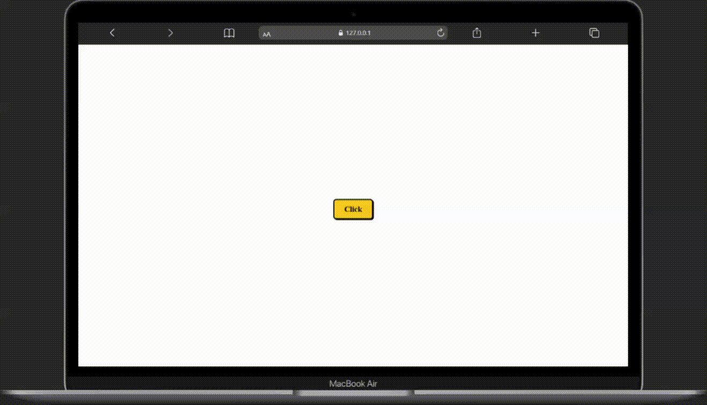 | **[Background Color Changer](./background-color-changer)** | Clicking the button changes the background color randomly. A simple practice for DOM manipulation and event handling. | — | — |
| 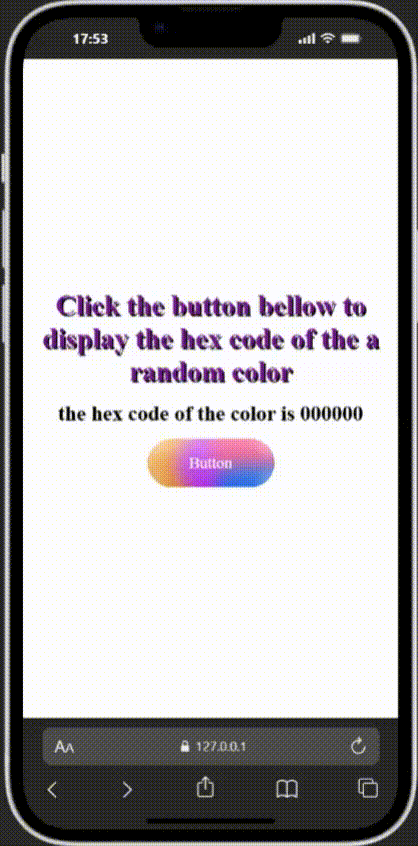 | **[Random Background Color Changer](./random-background-color-changer)** | Generates random hex colors and applies them to the background. Also displays the generated color code. | — | — |
| 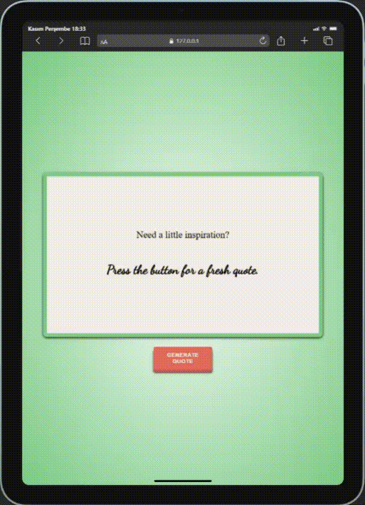 | **[Random Quote Generator](./random-quote-generator)** | Displays a random quote on each button click. Good for practicing dynamic content updates. | — | — |
| 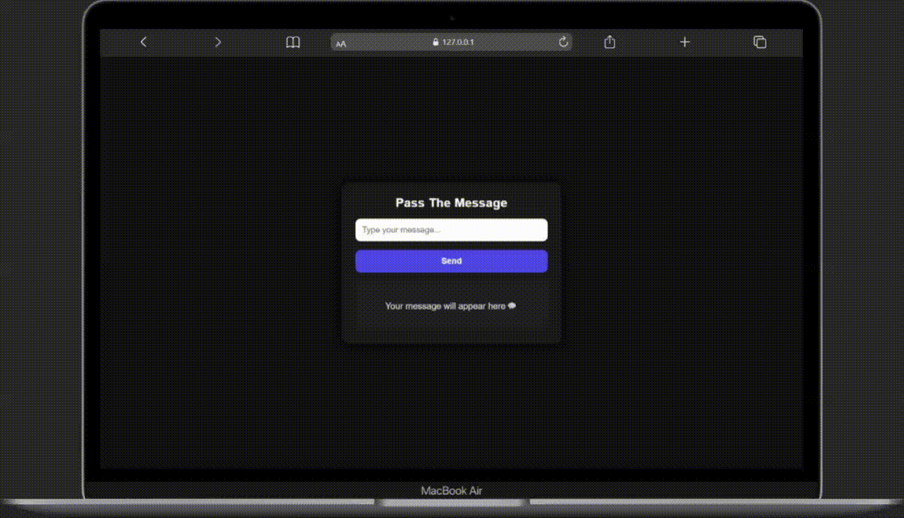 | **[Pass The Message](./pass-the-messages)** | Lets the user type a message and display it instantly. Focuses on DOM manipulation, input validation, and event handling. | — | — |
| 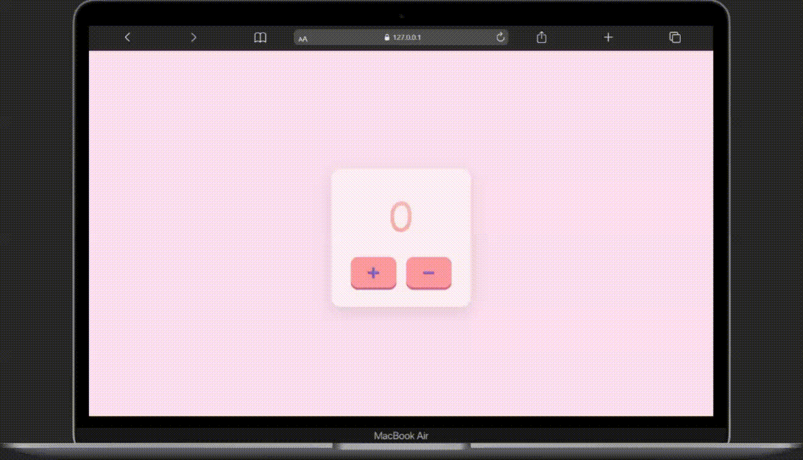 | **[Counter](./counter)** | A basic counter app with + and - buttons. Clicking increases or decreases the number. Great for beginners practicing DOM manipulation and simple state handling. | — | — |
| 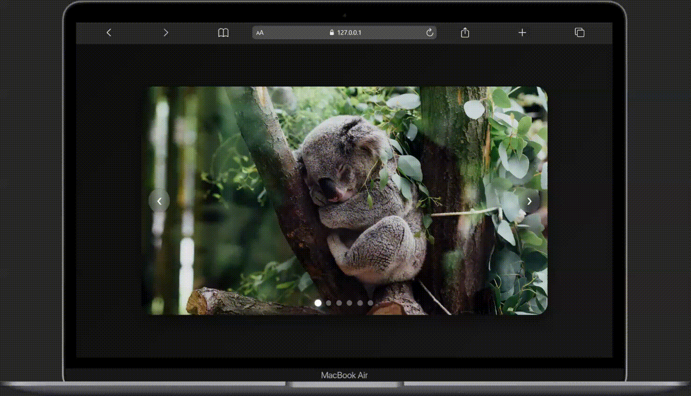 | **[Image Carousel](./image-carousel)** | A responsive image carousel with next/prev controls and clickable dot navigation. Built using HTML, CSS, and JavaScript. | — | — |
| 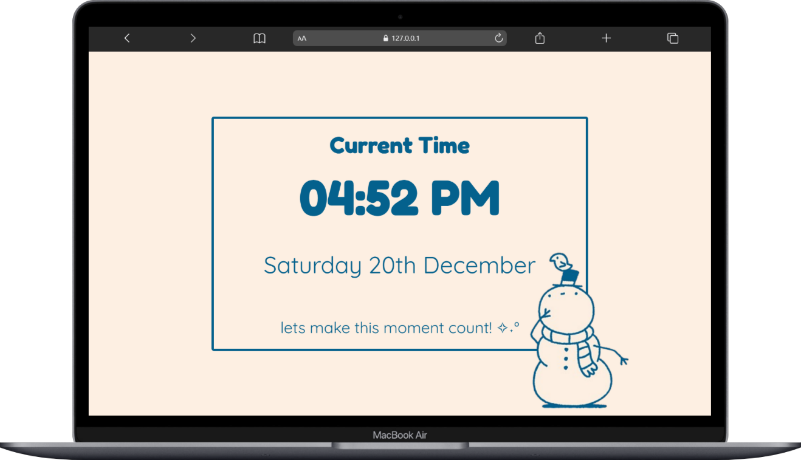 | **[Local Date & Time](./local-date-and-time)** | Displays the current local date and time with proper formatting. Focuses on clean UI and JavaScript Date handling. | [Live](https://local-date-and-time.netlify.app/) | [Figma](https://www.figma.com/community/file/1583234516118868337/cozy-snowman-clock) |
| 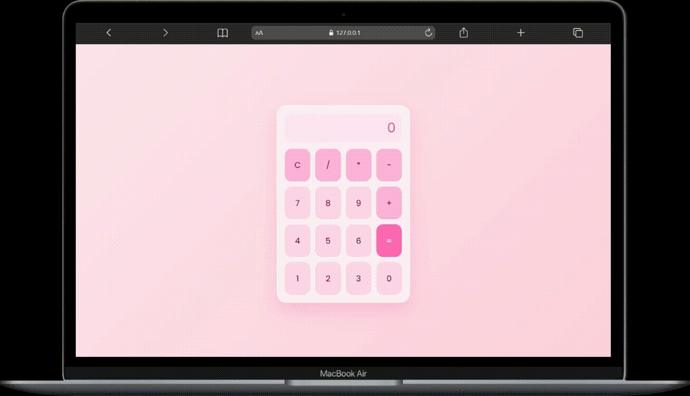 | **[Calculator A](./calculator)** | A simple calculator that performs basic arithmetic operations with a clean and responsive UI. Focuses on DOM manipulation, event handling, and calculation logic. | — | — |
| 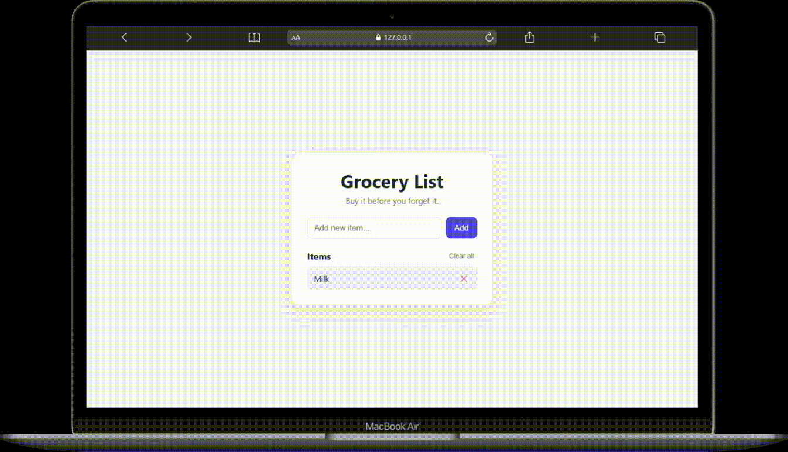 | **[Grocery List](./grocery-list)** | A simple grocery list application that allows users to add, delete, mark items as completed, and clear the entire list using vanilla JavaScript. Focuses on DOM manipulation and event handling. | — | — |
| 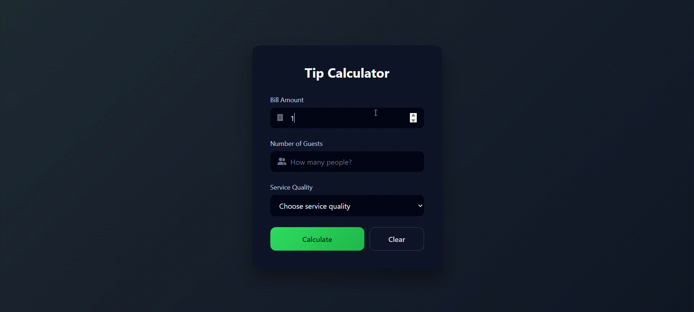 | **[Tip Calculator](./tip-calculator)** | A simple tip calculator that calculates the tip per person based on bill amount, number of guests, and service quality using vanilla JavaScript. Focuses on DOM manipulation, basic validation logic, and UI state handling. | — | — |
| 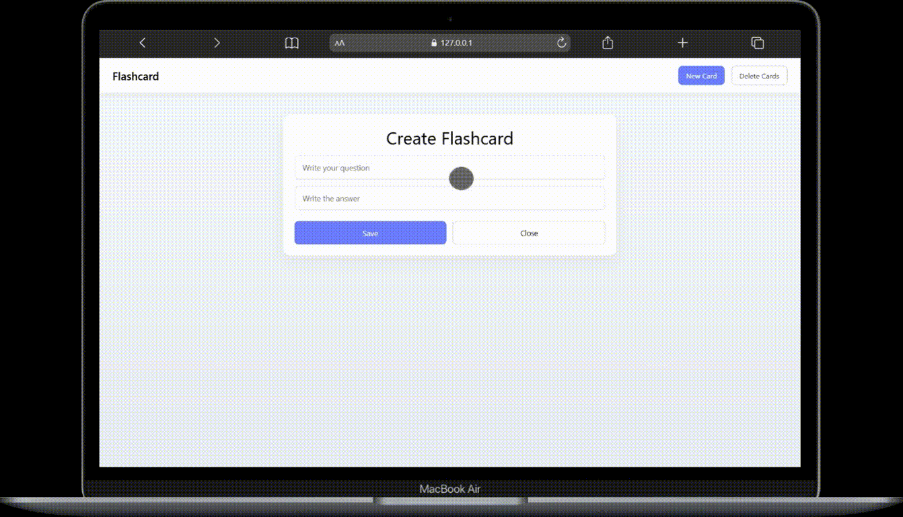 | **[Flashcard](./flashcards)** | A flashcard application that allows users to create, view, and delete flashcards with persistent data stored in localStorage. Focuses on DOM manipulation, event handling, and basic state management using vanilla JavaScript. | — | — |
| 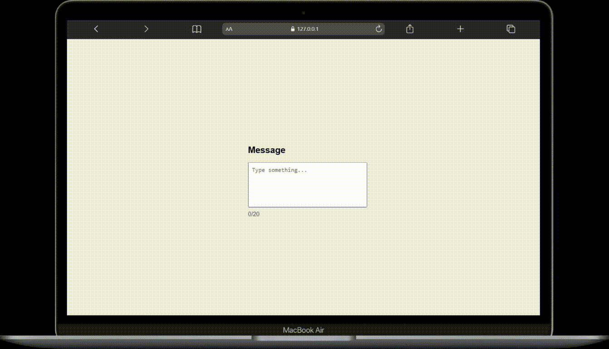 | **[Live Character Counter](./live-character-counter)** | A simple live character counter that displays the number of typed characters in real time and enforces a maximum character limit with visual feedback. Focuses on DOM manipulation, event handling, and conditional rendering using vanilla JavaScript. | — | — |
| 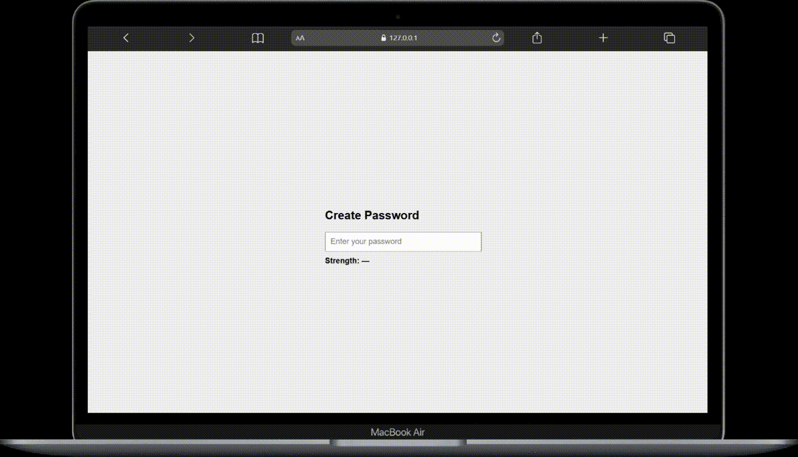 | **[Password Strength Checker](./password-strength-checker)** | A simple password strength checker that evaluates user input in real time based on length and character composition. Focuses on DOM manipulation, event handling, and basic validation logic using vanilla JavaScript. | — | — |
| 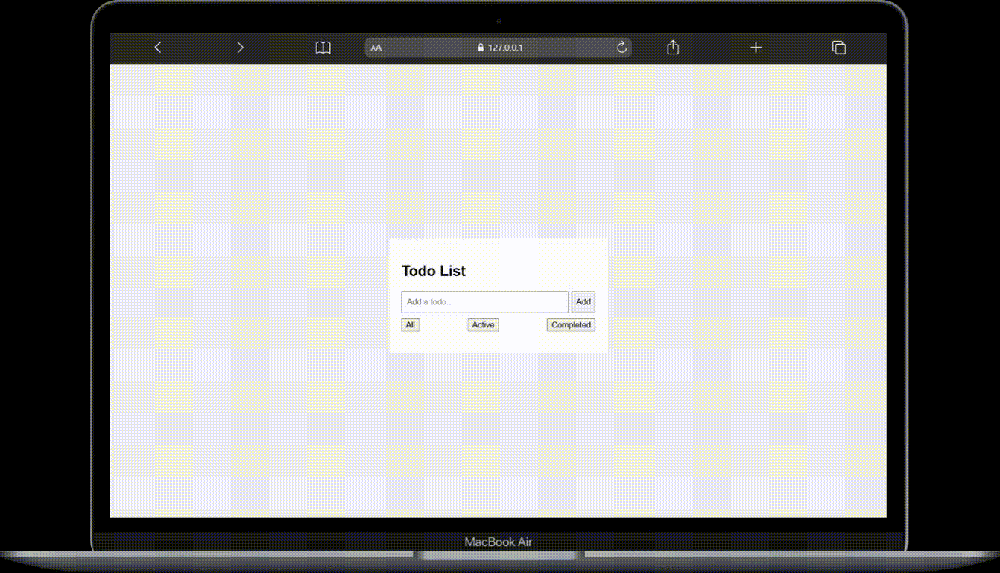 | **[Todo Filter](./todo-filter/)** | A simple todo application that allows users to add tasks, mark them as completed, and filter the list by all, active, or completed items. Focuses on DOM manipulation, event handling, and conditional rendering using vanilla JavaScript. | — | — |
| 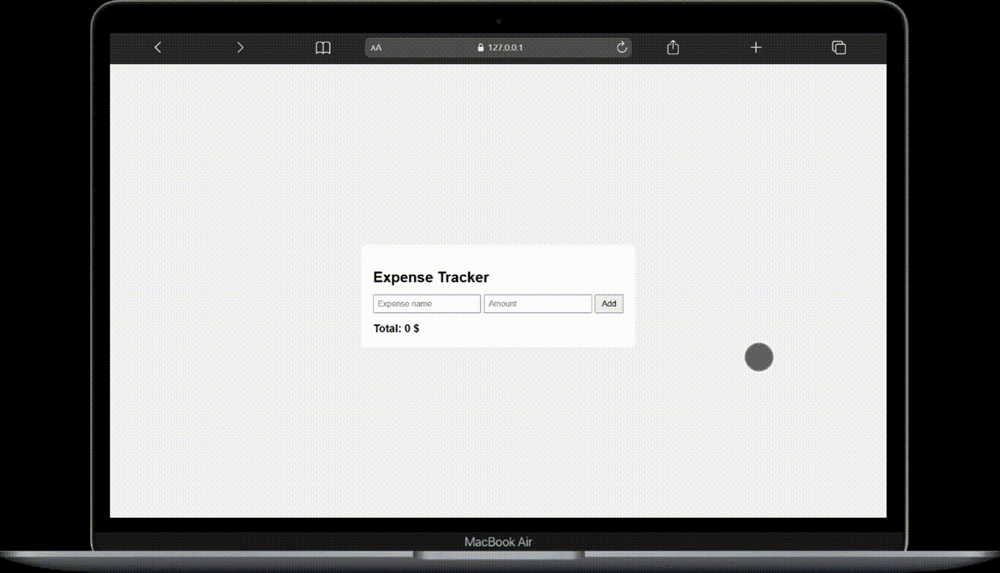 | **[Expense Tracker](./mini-expense-tracker/)** | A simple expense tracker application that allows users to add and delete expenses while automatically calculating the total amount. Focuses on DOM manipulation, event handling, and basic state management using vanilla JavaScript. | — | — |
| 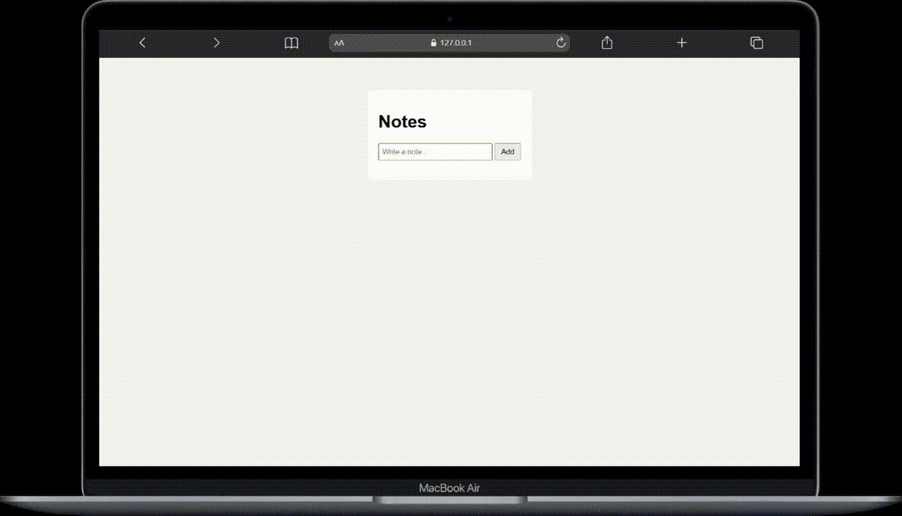 | **[Notes App](./persistent-notes/)** | A simple notes application that allows users to add and delete notes dynamically. Focuses on DOM manipulation, event handling, and handling user input using vanilla JavaScript. | — | — |
| 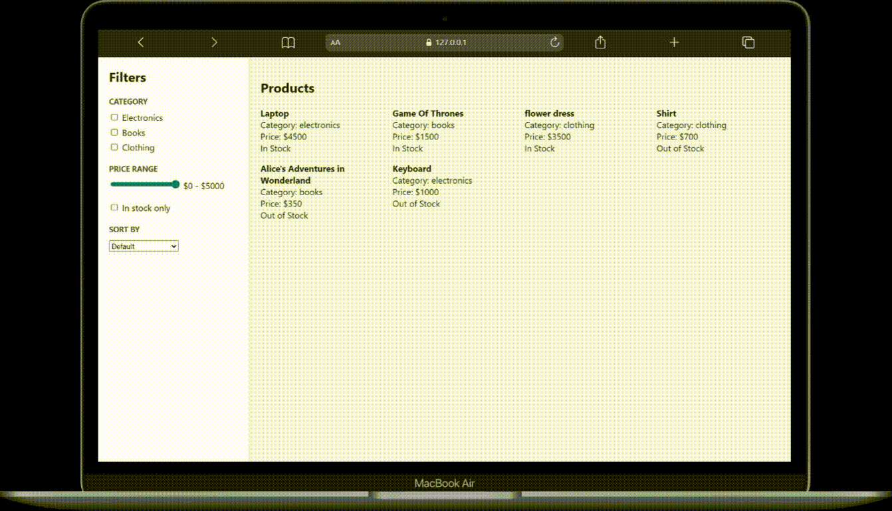 | **[Stateful Product Filter](./stateful-filter-engine//)** | A state-driven product filtering app that allows users to filter products by category, price range, stock availability, and sort order. Built with vanilla JavaScript, focusing on centralized state management, array filtering, and dynamic UI rendering. | — | — |

_(More projects will be added as I continue learning.)_

## Future Additions

- Beginner-friendly components (profile cards, interactive menus)  
- Mini-games and logic exercises  
- More advanced JavaScript applications as I progress

## How to Use

This is mainly a personal repository to track my learning process.  
Feel free to explore the code, provide feedback, or get inspiration from the projects.

## License

This repository is for learning and personal use.
