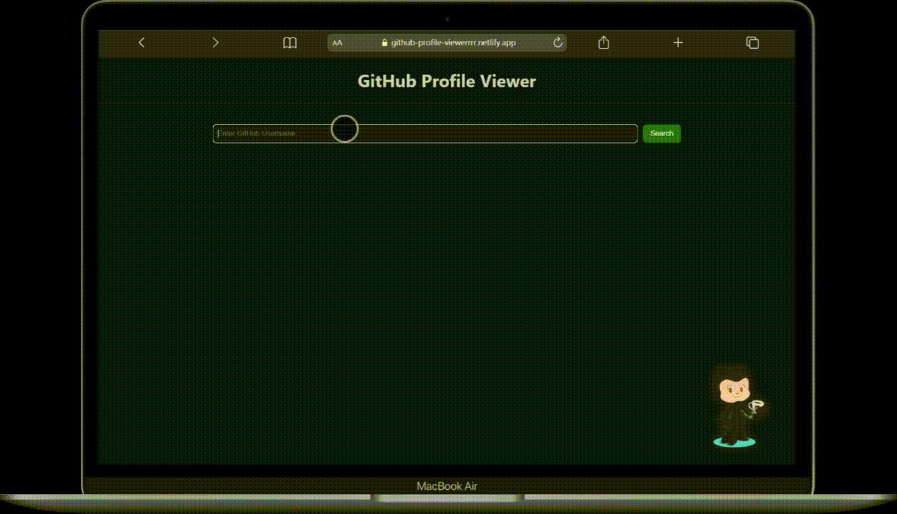

# GitHub Profile Viewer
[](https://app.netlify.com/projects/github-profile-viewerrrr/deploys)

A GitHub profile viewer application built with vanilla JavaScript.  
This app allows users to search for any GitHub username and dynamically display profile information and public repositories using the GitHub REST API — without reloading the page.

---

## Live Demo

https://github-profile-viewerrrr.netlify.app/

---

## Preview



---

## Features

- Search any GitHub user by username
- Fetch data using GitHub REST API
- Dynamic profile rendering:
  - Avatar
  - Name
  - Bio
  - Followers / Following
  - Public repository count
- Display user repositories dynamically
- Loading state handling
- Error handling (invalid user / failed request)
- Input validation (empty search prevention)
- Enter key support
- Previous result cleanup before new search
- No page reloads

---

## Technologies Used

- **HTML5**
- **CSS3**
- **JavaScript (ES6+)**
- **GitHub REST API**

---

## Project Structure
```
├── index.html
├── style.css
├── script.js
├── images  
└── README.md
```


---

## How It Works

- The username is captured via an input field.
- DOM elements are selected using `querySelector`.
- Event listeners are attached to:
  - Search button
  - Input field (Enter key support)
- A `fetch()` request is sent to the GitHub API.
- Loading state is displayed while waiting for the response.
- If the user exists:
  - Profile data is rendered dynamically.
  - Repositories are fetched and listed.
- If an error occurs:
  - An appropriate error message is displayed.
  - The application state is reset properly.
- The UI updates dynamically based on application state.

---

## How to Run Locally

1. Clone the repository.
2. Open `index.html` in your browser.
3. Enter a GitHub username and search.

---

## Learning Goals

This project was created to practice:

- Working with external APIs
- Asynchronous JavaScript (`fetch`, Promises)
- State-based UI updates
- DOM manipulation
- Event handling
- Error and loading state management
- Separation of concerns in frontend development
