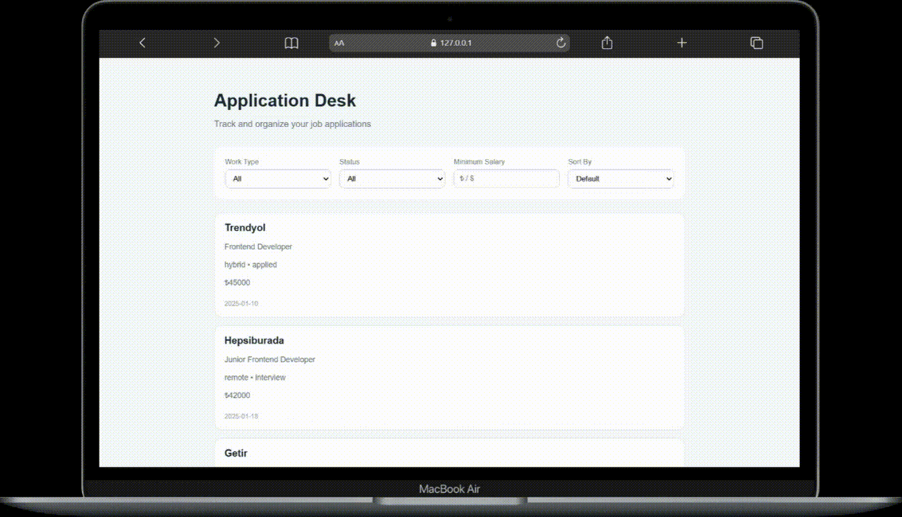

# Job Application Tracker with Filtering & Sorting

A job application tracking application built with vanilla JavaScript.  
This app allows users to manage, filter, and sort job applications dynamically without reloading the page.

---

## 📸 Preview



---

## 🚀 Features

- Dynamic rendering of job applications
- Filter by:
  - Work Type (remote, hybrid, onsite)
  - Application Status (applied, interview, offer, rejected)
  - Minimum Salary
- Sort by:
  - Salary (ascending / descending)
  - Application Date (newest / oldest)
- Centralized filter state management
- Real-time UI updates
- Responsive layout
- No page reloads

---

## 🛠 Technologies Used

- **HTML5**
- **CSS3**
- **JavaScript (ES6+)**

---

## 📂 Project Structure

```
├── index.html
├── style.css
├── script.js
├── proejct-preview
└── README.md

```

---

## 🧠 How It Works

- All job data is stored inside an `applications` array.
- Active filter values are managed in a centralized `filteredState` object.
- The `applyFilters()` function:
  - Filters applications based on selected criteria
  - Applies salary filtering
  - Applies status and work type filtering
  - Sorts the filtered results dynamically
- The UI is re-rendered after each filtering or sorting action.
- State management, filtering logic, and rendering logic are separated for better maintainability.

---

## ▶️ How to Run

1. Clone or download the repository.
2. Open `index.html` in your browser.
3. Use filtering and sorting controls to manage job applications.

---

## 📌 Learning Goals

This project was created to practice:

- State-driven UI management
- Filtering and sorting algorithms
- Array methods (`filter`, `sort`, `map`)
- DOM manipulation
- Event handling
- Separation of concerns in frontend development

