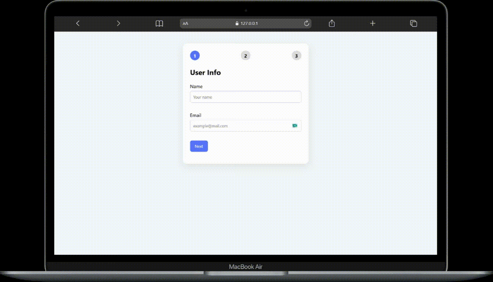

# Multi-Step Form with State Management

This is a multi-step form application built with vanilla JavaScript.
The form collects user information step by step, validates inputs at each stage,
and displays a summary before final submission without reloading the page.

## Preview

## Features

- Multi-step form flow (3 steps)
- Step-by-step validation
- Centralized state management
- Email format validation
- Required role selection
- Dynamic step indicator
- Summary screen before submit
- Simulated submit feedback (success message)
- No page reloads

## Technologies Used

- HTML
- CSS
- JavaScript (Vanilla)

## Project Structure

index.html  
style.css  
script.js  

## How It Works

- All form data and errors are stored in a single `formState` object.
- The current step is tracked with `formState.currentStep`.
- Navigation buttons (`Next` / `Back`) update the step state.
- Each step has its own validation function:
  - Step 1: Name and email validation
  - Step 2: Role selection validation
- The UI updates based on the current step using `updateSteps()`.
- On the final step, a summary is rendered dynamically from the state.
- Submitting the form shows a simulated success message.

## How to Run

1. Clone or download the repository.
2. Open `index.html` in a browser.
3. Fill in the form and navigate through the steps.

## Notes

This project was created for learning purposes to practice:
- State-based UI management
- Multi-step form logic
- Input validation
- DOM manipulation
- Event handling
- Separating state, validation, and rendering logic
